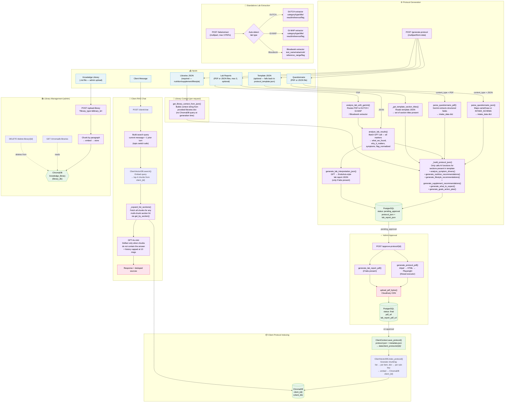
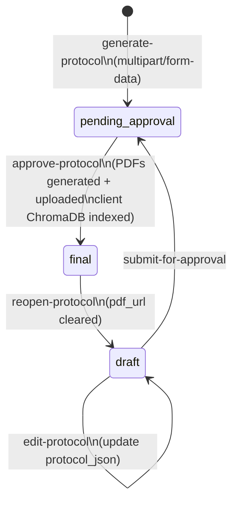
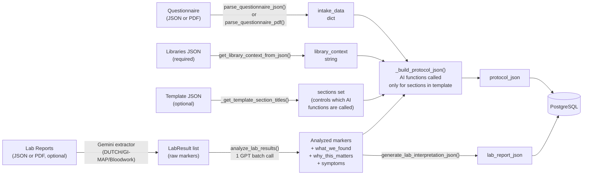
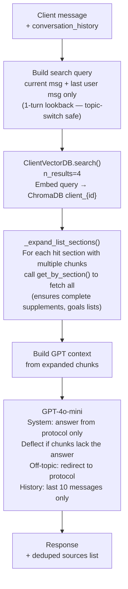

# Be Balanced AI — System Flowchart

```mermaid
flowchart TD

    %% INPUTS
    subgraph INPUT["📥 Inputs"]
        A1["Questionnaire\n(PDF or JSON file)"]
        A2["Lab Reports\n(PDF or JSON files, max 3, optional)"]
        A3["Libraries JSON\n(required — nutrition/supplement/lifestyle)"]
        A4["Template JSON\n(optional — falls back to protocol_template.json)"]
        A5["Knowledge Library\n(.md file — admin upload)"]
        A6["Client Message"]
    end

    %% PROTOCOL GENERATION
    subgraph GENERATE["⚙️ Protocol Generation"]
        B["POST /generate-protocol\n(multipart/form-data)"]

        C1["parse_questionnaire_json()\nMaps camelCase or INTAKE_SCHEMA\n→ intake_data dict"]
        C2["parse_questionnaire_pdf()\nGemini extracts structured fields\n→ intake_data dict"]

        D1["analyze_lab_with_gemini()\nRoutes PDF to DUTCH / GI-MAP\n/ Bloodwork extractor"]
        D2["analyze_lab_results()\nBatch GPT call — all markers\n→ what_we_found, why_it_matters,\nsymptoms, flag_normalized"]

        T["_get_template_section_titles()\nReads template JSON\n→ set of section titles present"]

        E["_build_protocol_json()\nOnly calls AI functions for\nsections present in template:\n• analyze_symptom_drivers()\n• generate_nutrition_recommendations()\n• generate_lifestyle_recommendations()\n• generate_supplement_recommendations()\n• generate_what_to_expect()\n• generate_goals_action_plan()"]

        F["generate_lab_interpretation_json()\nGPT → EndoAxis-style\nlab report JSON\n(only if labs present)"]

        G[("PostgreSQL\nstatus: pending_approval\nprotocol_json + lab_report_json")]
    end

    %% LIBRARY CONTEXT
    subgraph LIBCTX["📖 Library Context (per-request)"]
        LC["get_library_context_from_json()\nBuilds context string from\nprovided libraries dict\n(no ChromaDB query at generation time)"]
    end

    %% APPROVAL
    subgraph APPROVE["✅ Admin Approval"]
        H["POST /approve-protocol/{id}"]
        H1["generate_protocol_pdf()\nJinja2 → HTML → Playwright\n(thread executor)"]
        H2["generate_lab_report_pdf()\n(if labs present)"]
        H3["upload_pdf_bytes()\nCloudinary CDN"]
        H4[("PostgreSQL\nstatus: final\npdf_url\nlab_report_pdf_url")]
    end

    %% CLIENT INDEXING
    subgraph INDEX["📦 Client Protocol Indexing"]
        I1["ClientContext.save_protocol()\nprotocol.json + metadata.json\n→ data/client_protocols/{id}/"]
        I2["ClientVectorDB.index_protocol()\nGranular chunking:\nlist → per item, dict → per sub-key\n→ embed → ChromaDB client_{id}"]
        I3[("ChromaDB\nclient_{id}\n(client_db)")]
    end

    %% CLIENT CHAT
    subgraph CHAT["💬 Client RAG Chat"]
        J1["POST /client/chat"]
        J2["Build search query\ncurrent message + 1 prior turn\n(topic-switch safe)"]
        J3["ClientVectorDB.search()\nEmbed query\n→ top-4 chunks from client_{id}"]
        J3B["_expand_list_sections()\nFetch all chunks for any\nmulti-chunk section hit\nvia get_by_section()"]
        J4["GPT-4o-mini\nDeflect only when chunks\ndo not contain the answer\n+ history capped at 10 msgs"]
        J5["Response + deduped sources"]
    end

    %% LIBRARY MANAGEMENT
    subgraph LIBRARY["📚 Library Management (admin)"]
        L1["POST /upload-library\n?library_type=&library_id="]
        L2["Chunk by paragraph\n→ embed → store"]
        L3["GET /chromadb-libraries"]
        L4["DELETE /delete-library/{id}"]
        K2{{"ChromaDB\nknowledge_library\n(library_db)"}}
    end

    %% LAB EXTRACTION
    subgraph LABS["🔬 Standalone Lab Extraction"]
        M1["POST /labs/extract\n(multipart, max 3 PDFs)"]
        M2{"Auto-detect\nlab type"}
        M3["DUTCH extractor\ncategory/type/title/\nresult/reference/flag"]
        M4["GI-MAP extractor\ncategory/type/title/\nresult/reference/flag"]
        M5["Bloodwork extractor\ntest_name/value/unit/\nreference_range/flag"]
    end

    %% CONNECTIONS

    A1 -->|"content_type = PDF"| C2
    A1 -->|"content_type = JSON"| C1
    A2 -->|"PDF"| D1
    A2 -->|"JSON"| D2
    A3 --> LC
    A4 --> T

    B --> A1
    B --> A2
    B --> A3
    B --> A4

    C1 --> E
    C2 --> E
    D1 --> D2
    D2 --> E
    D2 --> F

    T --> E
    LC --> E

    E --> G
    F --> G

    G -->|"pending_approval"| H
    H --> H1
    H --> H2
    H1 --> H3
    H2 --> H3
    H3 --> H4

    H4 -->|"on approval"| I1
    I1 --> I2
    I2 --> I3

    A6 --> J1
    J1 --> J2
    J2 --> J3
    J3 --> J3B
    J3B --> I3
    J3B --> J4
    J4 --> J5

    A5 --> L1
    L1 --> L2
    L2 --> K2
    L3 -.->|"reads"| K2
    L4 -.->|"deletes from"| K2

    M1 --> M2
    M2 -->|"DUTCH"| M3
    M2 -->|"GI-MAP"| M4
    M2 -->|"Bloodwork"| M5

    %% STYLES
    classDef input fill:#e8f4f8,stroke:#2196F3,color:#000
    classDef process fill:#f3e8ff,stroke:#9C27B0,color:#000
    classDef storage fill:#e8f5e9,stroke:#4CAF50,color:#000
    classDef ai fill:#fff3e0,stroke:#FF9800,color:#000
    classDef output fill:#fce4ec,stroke:#E91E63,color:#000

    class A1,A2,A3,A4,A5,A6 input
    class B,C1,C2,D1,H,H1,H2,L1,L2,M1,M2,M3,M4,M5,J2,J3B process
    class G,H4,I1,I3,K2 storage
    class D2,E,F,J4,LC,T process
    class H3,J5 output
```

---

## Status Flow

```mermaid
stateDiagram-v2
    [*] --> pending_approval : generate-protocol\n(multipart/form-data)

    pending_approval --> final : approve-protocol\n(PDFs generated + uploaded\nclient ChromaDB indexed)

    final --> draft : reopen-protocol\n(pdf_url cleared)

    draft --> pending_approval : submit-for-approval

    draft --> draft : edit-protocol\n(update protocol_json)
```

---

## Data Flow Through AI Pipeline

```mermaid
flowchart LR
    Q["Questionnaire\n(JSON or PDF)"]
    L["Lab Reports\n(JSON or PDF, optional)"]
    LIB["Libraries JSON\n(required)"]
    TPL["Template JSON\n(optional)"]

    Q -->|"parse_questionnaire_json()\nor parse_questionnaire_pdf()"| ID["intake_data\ndict"]

    L -->|"Gemini extractor\n(DUTCH/GI-MAP/Bloodwork)"| LR["LabResult list\n(raw markers)"]

    LR -->|"analyze_lab_results()\n1 GPT batch call"| AM["Analyzed markers\n+ what_we_found\n+ why_this_matters\n+ symptoms"]

    LIB -->|"get_library_context_from_json()"| CTX["library_context\nstring"]
    TPL -->|"_get_template_section_titles()"| SEC["sections set\n(controls which AI\nfunctions are called)"]

    ID --> KB["_build_protocol_json()\nAI functions called\nonly for sections in template"]
    AM --> KB
    CTX --> KB
    SEC --> KB

    KB --> PJ["protocol_json"]
    AM -->|"generate_lab_interpretation_json()"| LJ["lab_report_json"]

    PJ --> DB[("PostgreSQL")]
    LJ --> DB
```

---

## Client RAG Chat Detail

```mermaid
flowchart TD
    MSG["Client message\n+ conversation_history"]

    MSG --> SQ["Build search query\ncurrent msg + last user msg only\n(1-turn lookback — topic-switch safe)"]

    SQ --> VS["ClientVectorDB.search()\nn_results=4\nEmbed query → ChromaDB client_{id}"]

    VS --> EXP["_expand_list_sections()\nFor each hit section with multiple chunks\ncall get_by_section() to fetch all\n(ensures complete supplements, goals lists)"]

    EXP --> CTX["Build GPT context\nfrom expanded chunks"]

    CTX --> GPT["GPT-4o-mini\nSystem: answer from protocol only\nDeflect if chunks lack the answer\nOff-topic: redirect to protocol\nHistory: last 10 messages only"]

    GPT --> RESP["Response\n+ deduped sources list"]
```
