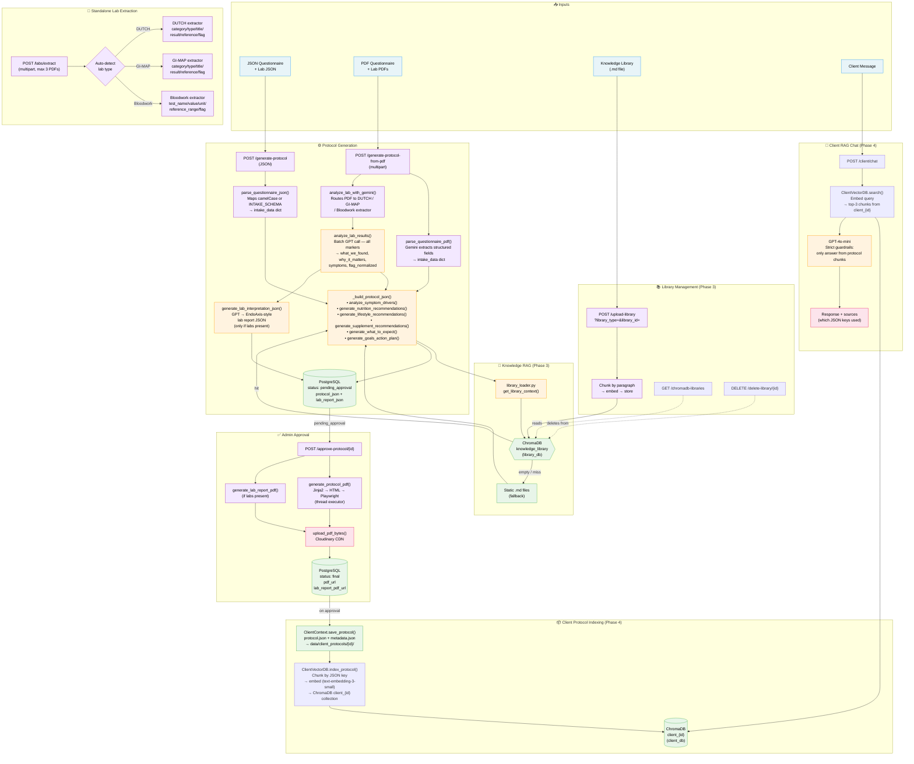
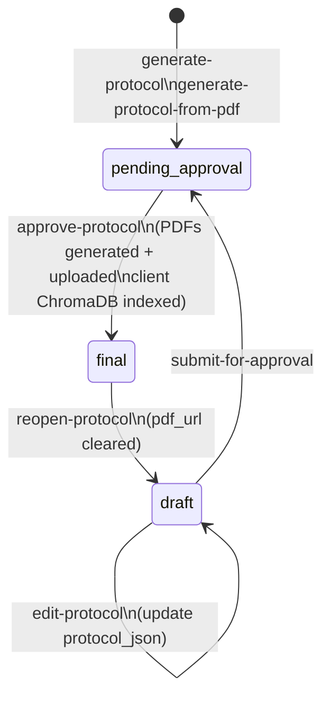
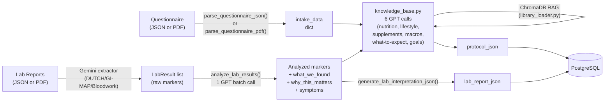

# Be Balanced AI — System Flowchart

```mermaid
flowchart TD

    %% ─── INPUTS ───────────────────────────────────────────────
    subgraph INPUT["📥 Inputs"]
        A1["JSON Questionnaire\n+ Lab JSON"]
        A2["PDF Questionnaire\n+ Lab PDFs"]
        A3["Knowledge Library\n(.md file)"]
        A4["Client Message"]
    end

    %% ─── PROTOCOL GENERATION ──────────────────────────────────
    subgraph GENERATE["⚙️ Protocol Generation"]
        B1["POST /generate-protocol\n(JSON)"]
        B2["POST /generate-protocol-from-pdf\n(multipart)"]

        C1["parse_questionnaire_json()\nMaps camelCase or INTAKE_SCHEMA\n→ intake_data dict"]
        C2["parse_questionnaire_pdf()\nGemini extracts structured fields\n→ intake_data dict"]

        D1["analyze_lab_with_gemini()\nRoutes PDF to DUTCH / GI-MAP\n/ Bloodwork extractor"]
        D2["analyze_lab_results()\nBatch GPT call — all markers\n→ what_we_found, why_it_matters,\nsymptoms, flag_normalized"]

        E["_build_protocol_json()\n• analyze_symptom_drivers()\n• generate_nutrition_recommendations()\n• generate_lifestyle_recommendations()\n• generate_supplement_recommendations()\n• generate_what_to_expect()\n• generate_goals_action_plan()"]

        F["generate_lab_interpretation_json()\nGPT → EndoAxis-style\nlab report JSON\n(only if labs present)"]

        G[("PostgreSQL\nstatus: pending_approval\nprotocol_json + lab_report_json")]
    end

    %% ─── KNOWLEDGE RAG ────────────────────────────────────────
    subgraph KNOWLEDGE["🧠 Knowledge RAG (Phase 3)"]
        K1["library_loader.py\nget_library_context()"]
        K2{{"ChromaDB\nknowledge_library\n(library_db)"}}
        K3["Static .md files\n(fallback)"]
    end

    %% ─── APPROVAL ─────────────────────────────────────────────
    subgraph APPROVE["✅ Admin Approval"]
        H["POST /approve-protocol/{id}"]
        H1["generate_protocol_pdf()\nJinja2 → HTML → Playwright\n(thread executor)"]
        H2["generate_lab_report_pdf()\n(if labs present)"]
        H3["upload_pdf_bytes()\nCloudinary CDN"]
        H4[("PostgreSQL\nstatus: final\npdf_url\nlab_report_pdf_url")]
    end

    %% ─── CLIENT INDEXING ──────────────────────────────────────
    subgraph INDEX["📦 Client Protocol Indexing (Phase 4)"]
        I1["ClientContext.save_protocol()\nprotocol.json + metadata.json\n→ data/client_protocols/{id}/"]
        I2["ClientVectorDB.index_protocol()\nChunk by JSON key\n→ embed (text-embedding-3-small)\n→ ChromaDB client_{id} collection"]
        I3[("ChromaDB\nclient_{id}\n(client_db)")]
    end

    %% ─── CLIENT CHAT ──────────────────────────────────────────
    subgraph CHAT["💬 Client RAG Chat (Phase 4)"]
        J1["POST /client/chat"]
        J2["ClientVectorDB.search()\nEmbed query\n→ top-3 chunks from client_{id}"]
        J3["GPT-4o-mini\nStrict guardrails:\nonly answer from protocol chunks"]
        J4["Response + sources\n(which JSON keys used)"]
    end

    %% ─── LIBRARY MANAGEMENT ───────────────────────────────────
    subgraph LIBRARY["📚 Library Management (Phase 3)"]
        L1["POST /upload-library\n?library_type=&library_id="]
        L2["Chunk by paragraph\n→ embed → store"]
        L3["GET /chromadb-libraries"]
        L4["DELETE /delete-library/{id}"]
    end

    %% ─── LAB EXTRACTION ───────────────────────────────────────
    subgraph LABS["🔬 Standalone Lab Extraction"]
        M1["POST /labs/extract\n(multipart, max 3 PDFs)"]
        M2{"Auto-detect\nlab type"}
        M3["DUTCH extractor\ncategory/type/title/\nresult/reference/flag"]
        M4["GI-MAP extractor\ncategory/type/title/\nresult/reference/flag"]
        M5["Bloodwork extractor\ntest_name/value/unit/\nreference_range/flag"]
    end

    %% ─── CONNECTIONS ──────────────────────────────────────────

    A1 --> B1
    A2 --> B2

    B1 --> C1
    B2 --> C2
    B2 --> D1

    C1 --> E
    C2 --> E
    D1 --> D2
    D2 --> E
    D2 --> F

    E --> K1
    K1 --> K2
    K2 -->|"empty / miss"| K3
    K3 --> E
    K2 -->|"hit"| E

    E --> G
    F --> G

    G -->|"pending_approval"| H
    H --> H1
    H --> H2
    H1 --> H3
    H2 --> H3
    H3 --> H4

    H4 -->|"on approval"| I1
    I1 --> I2
    I2 --> I3

    A4 --> J1
    J1 --> J2
    J2 --> I3
    J2 --> J3
    J3 --> J4

    A3 --> L1
    L1 --> L2
    L2 --> K2
    L3 -.->|"reads"| K2
    L4 -.->|"deletes from"| K2

    M1 --> M2
    M2 -->|"DUTCH"| M3
    M2 -->|"GI-MAP"| M4
    M2 -->|"Bloodwork"| M5

    %% ─── STYLES ───────────────────────────────────────────────
    classDef input fill:#e8f4f8,stroke:#2196F3,color:#000
    classDef process fill:#f3e8ff,stroke:#9C27B0,color:#000
    classDef storage fill:#e8f5e9,stroke:#4CAF50,color:#000
    classDef ai fill:#fff3e0,stroke:#FF9800,color:#000
    classDef output fill:#fce4ec,stroke:#E91E63,color:#000

    class A1,A2,A3,A4 input
    class B1,B2,C1,C2,D1,H,H1,H2,L1,L2,M1,M2,M3,M4,M5 process
    class G,H4,I1,I3,K2,K3 storage
    class D2,E,F,J3,K1 ai
    class H3,J4 output
```

---

## Status Flow (simplified)

```mermaid
stateDiagram-v2
    [*] --> pending_approval : generate-protocol\ngenerate-protocol-from-pdf

    pending_approval --> final : approve-protocol\n(PDFs generated + uploaded\nclient ChromaDB indexed)

    final --> draft : reopen-protocol\n(pdf_url cleared)

    draft --> pending_approval : submit-for-approval

    draft --> draft : edit-protocol\n(update protocol_json)
```

---

## Data Flow Through AI Pipeline

```mermaid
flowchart LR
    Q["Questionnaire\n(JSON or PDF)"]
    L["Lab Reports\n(JSON or PDF)"]

    Q -->|"parse_questionnaire_json()\nor parse_questionnaire_pdf()"| ID["intake_data\ndict"]

    L -->|"Gemini extractor\n(DUTCH/GI-MAP/Bloodwork)"| LR["LabResult list\n(raw markers)"]

    LR -->|"analyze_lab_results()\n1 GPT batch call"| AM["Analyzed markers\n+ what_we_found\n+ why_this_matters\n+ symptoms"]

    ID --> KB["knowledge_base.py\n6 GPT calls\n(nutrition, lifestyle,\nsupplements, macros,\nwhat-to-expect, goals)"]
    AM --> KB

    KB -->|"ChromaDB RAG\n(library_loader.py)"| KB

    KB --> PJ["protocol_json"]
    AM -->|"generate_lab_interpretation_json()"| LJ["lab_report_json"]

    PJ --> DB[("PostgreSQL")]
    LJ --> DB
```
